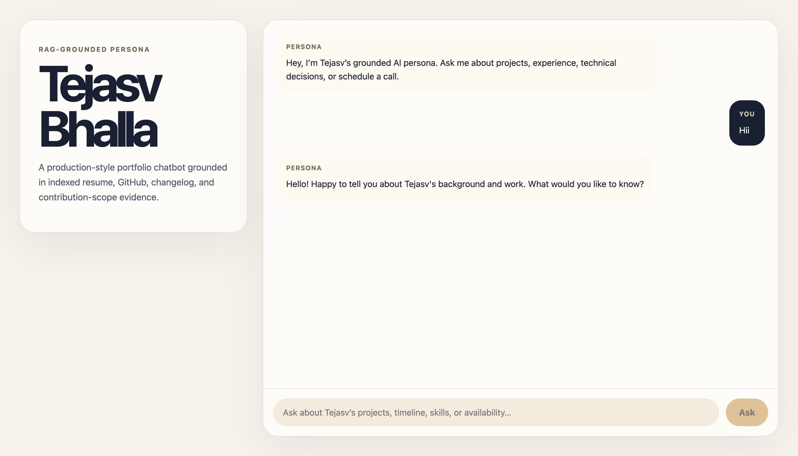
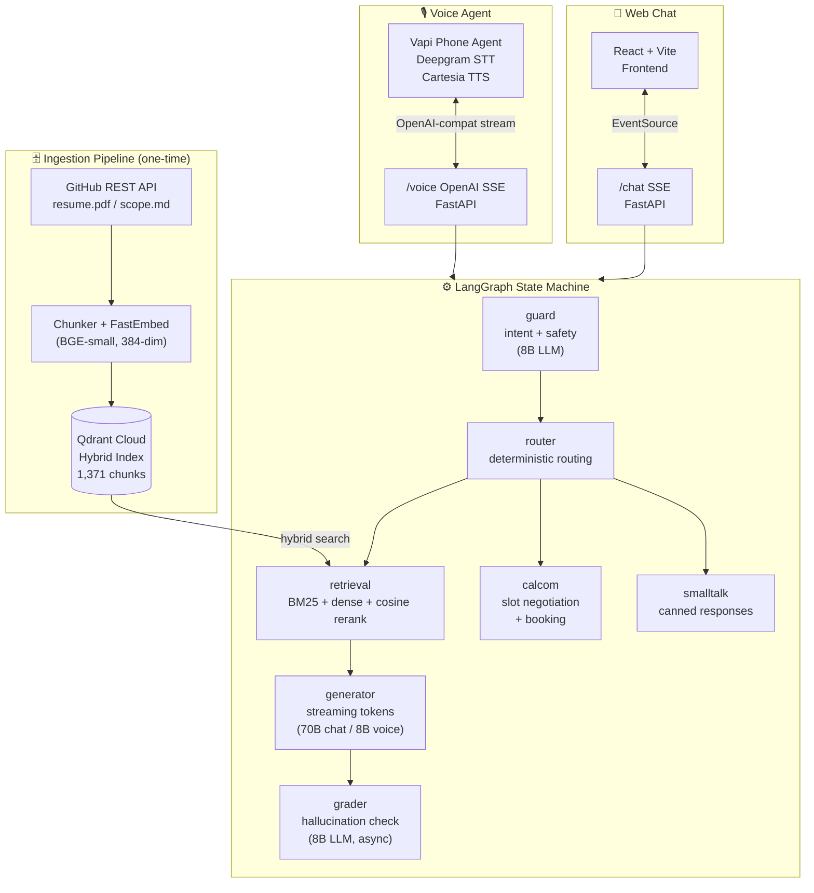

# AI Persona — RAG-Grounded Portfolio Voice & Chat Agent

> A production-grade, dual-mode AI persona for **Tejasv Bhalla** that answers recruiter questions grounded entirely in indexed personal knowledge, schedules meetings via live Cal.com integration, and completes end-to-end voice bookings — including verbal email capture — without any screen interaction.

[](https://python.org)
[](https://fastapi.tiangolo.com)
[](https://github.com/langchain-ai/langgraph)
[](https://qdrant.tech)
[](https://groq.com)
[](https://vapi.ai)
[](https://render.com)
[](https://github.com/Tejasv-bhalla/AI_Persona/actions/workflows/keep_alive.yml)



---

## Table of Contents

- [Overview](#overview)
- [Architecture](#architecture)
- [Feature Set](#feature-set)
- [Technology Stack](#technology-stack)
- [Cost Breakdown](#cost-breakdown)
- [Repository Structure](#repository-structure)
- [Prerequisites](#prerequisites)
- [Environment Variables](#environment-variables)
- [Local Setup](#local-setup)
- [Deployment](#deployment)
- [Voice Agent — Vapi Setup](#voice-agent--vapi-setup)
- [API Reference](#api-reference)
- [Graph Pipeline Deep Dive](#graph-pipeline-deep-dive)
- [Voice Booking Flow](#voice-booking-flow)
- [Performance Optimizations](#performance-optimizations)
- [Known Limitations & Tradeoffs](#known-limitations--tradeoffs)
- [License](#license)

---

## Overview

This project implements an AI-powered portfolio persona that operates across **two channels**:

| Channel | Interface | Description |
|:---|:---|:---|
| **Web Chat** | Browser (React + Vite) | Streaming RAG chat grounded in personal knowledge base |
| **Voice Call** | Phone (via Vapi) | Full conversational phone agent with real-time calendar booking |

Both channels share the same **LangGraph state machine** and **Qdrant retrieval backend**, ensuring consistent, hallucination-grounded responses across all surfaces.

---

## Architecture

### System Diagram



### Request Flow (Text)

```
guard → router → retrieval → generator → (async grader)
                ↘ calcom   (scheduling intent)
                ↘ smalltalk (greeting / off-topic)
                ↘ end_call  (voice termination)
```

---

## Feature Set

### Web Chat
- **Streaming responses** via Server-Sent Events (SSE).
- **Hybrid RAG retrieval**: BM25 sparse + dense vector search with cosine reranker.
- **Hallucination grading**: Every chat response is asynchronously graded by an LLM judge; ungrounded answers are flagged with a visual indicator.
- **Source-filtered retrieval**: The guard node infers the most likely source type (`resume`, `code`, `readme`, `changelog`, etc.) and narrows the Qdrant search accordingly.
- **Friendly rate-limit handling**: 429 errors from Groq are caught and surfaced as a polite user-facing message rather than a raw error.
- **Safety boundary**: Raw user input never reaches the generator. The guard node distills it into sanitized keywords before retrieval.

### Voice Agent
- **Full phone booking** — zero screen required. The caller requests availability, the bot offers one slot at a time, captures name and email verbally, and finalizes the Cal.com booking via API.
- **Fast-Start streaming**: The first 4 words are flushed immediately to Vapi, reducing perceived Time-to-First-Audio to ~850ms.
- **Sentence-level streaming**: After the fast-start phrase, responses are streamed sentence-by-sentence to maintain natural TTS prosody.
- **Semantic response cache**: In-process cosine similarity cache avoids redundant LLM calls for repeated questions within the same session (TTL: 1 hour, threshold: 0.88).
- **Verbal email parsing**: Normalizes Deepgram transcriptions (`"john dot doe at gmail dot com."`) to clean email addresses.
- **Slot negotiation state machine**: The router recovers scheduling context statelessly from conversation history, ensuring the bot never loses track of which slot is being discussed.

---

## Technology Stack

### Backend
| Component | Technology |
|:---|:---|
| API Framework | FastAPI 0.111+ |
| State Machine | LangGraph 0.2+ |
| LLM Provider | Groq Cloud (LPU inference) |
| Chat Model | `llama-3.3-70b-versatile` |
| Voice / Guard / Grader Model | `llama-3.1-8b-instant` |
| Vector DB | Qdrant Cloud |
| Embedding Model | `BAAI/bge-small-en-v1.5` (FastEmbed, 384-dim) |
| Sparse Search | BM25 (custom encoder) |
| Calendar | Cal.com v2 API |
| HTTP Client | httpx (async, persistent connection pool) |
| Serialization | orjson |
| Runtime | Python 3.11+, Uvicorn |
| Containerization | Docker (python:3.11-slim) |

### Frontend
| Component | Technology |
|:---|:---|
| Framework | React 18 + TypeScript |
| Bundler | Vite 5 |
| Styling | Vanilla CSS |
| Streaming | EventSource / SSE |

### Voice Infrastructure
| Component | Technology |
|:---|:---|
| Phone Platform | Vapi |
| Speech-to-Text | Deepgram (via Vapi) |
| Text-to-Speech | Cartesia (via Vapi) |
| Custom LLM | OpenAI-compatible SSE endpoint (`/voice`) |

### Deployment
| Service | Platform |
|:---|:---|
| Backend | Render (Free tier, Docker) |
| Frontend | Vercel / Netlify |
| Vector DB | Qdrant Cloud |

---

## Cost Breakdown

> All costs reflect **free-tier usage** as deployed. Upgrade costs are noted where relevant.

### Per Chat Session (≈ 5 turns)

| Component | Free Tier Usage | Approx. Cost |
|:---|:---|:---|
| Groq `llama-3.3-70b-versatile` (generation) | ~2,000 tokens | **$0.00** (100K TPD free) |
| Groq `llama-3.1-8b-instant` (guard + grader) | ~1,500 tokens | **$0.00** (free) |
| Qdrant Cloud (vector search) | 5 hybrid queries | **$0.00** (free cluster) |
| FastEmbed (local embedding) | 5 embeddings | **$0.00** (runs in-process) |
| **Total per session** | | **~$0.00** |

> At paid Groq rates (~$0.59/1M tokens for 70B), 5 turns ≈ **$0.001 per session**.

### Per Voice Call (≈ 3 min booking call)

| Component | Free Tier Usage | Approx. Cost |
|:---|:---|:---|
| Vapi platform fee | ~3 min call | **~$0.09** ($0.05/min + STT/TTS) |
| Deepgram STT (via Vapi) | ~3 min audio | Included in Vapi |
| Cartesia TTS (via Vapi) | ~500 words spoken | Included in Vapi |
| Groq `llama-3.1-8b-instant` (voice generation) | ~3,000 tokens | **$0.00** (free tier) |
| Cal.com booking API | 1 booking | **$0.00** (free plan) |
| **Total per call** | | **~$0.05–$0.10** |

### Monthly Infrastructure (Current Stack)

| Service | Plan | Monthly Cost |
|:---|:---|:---|
| Render (backend) | Free | **$0.00** |
| Qdrant Cloud | Free (1 node, 1GB) | **$0.00** |
| Groq Cloud | Free | **$0.00** |
| Vercel / Netlify (frontend) | Free | **$0.00** |
| Vapi | Pay-per-minute | **~$0.05–0.10/call** |
| Cal.com | Free | **$0.00** |
| **Total** | | **$0.00 fixed + usage** |

> **Note:** The only real cost is Vapi's per-minute charge for voice calls. Everything else runs free.

---

## Repository Structure

```
.
├── backend/
│   ├── Dockerfile
│   ├── pyproject.toml
│   ├── .env.example
│   └── src/rag_persona/
│       ├── main.py              # FastAPI app, /chat, /voice, /book, /vapi-webhook
│       ├── config.py            # Pydantic settings (env-driven)
│       ├── schemas.py           # TypedDicts, Pydantic models, enums
│       ├── graph.py             # LangGraph state machine builder
│       ├── prompts.py           # All LLM system prompts
│       ├── nodes/
│       │   ├── guard.py         # Safety + intent classification
│       │   ├── router.py        # Deterministic + context-aware routing
│       │   ├── retrieval.py     # Hybrid search + reranker + semantic cache
│       │   ├── calcom.py        # Calendar availability + verbal booking flow
│       │   ├── generator.py     # Streaming token generator
│       │   ├── grader.py        # LLM hallucination judge
│       │   └── smalltalk.py     # Canned small-talk responses
│       ├── services/
│       │   ├── groq_client.py   # Groq async wrapper (stream + JSON + 429 fallback)
│       │   ├── qdrant_store.py  # Hybrid search, upsert, collection management
│       │   ├── embeddings.py    # FastEmbed dense embedding service
│       │   └── calcom.py        # Cal.com v2 API client (slots + bookings)
│       ├── voice/
│       │   ├── vapi_adapter.py  # Parse Vapi payload + format OpenAI SSE stream
│       │   └── response_cache.py # In-process semantic cache (vector + TTL)
│       └── ingestion/
│           └── bm25.py          # BM25 sparse encoder
├── frontend/
│   ├── index.html
│   ├── package.json
│   └── src/
│       └── main.tsx             # Chat UI with SSE streaming + voice widget
├── ingestion/
│   ├── pipeline.py              # CLI ingestion runner
│   ├── .env.example
│   └── data/                    # Place resume.pdf + contribution_scope_*.md here
├── eval/
│   ├── run_evals.py             # Ragas + custom judge evaluation runner
│   └── golden_qa.json           # 10-question Golden Q&A test suite
├── evals_report.md              # Final evaluation report
├── render.yaml                  # Render deployment manifest
└── README.md
```

---

## Prerequisites

- **Python 3.11+**
- **Node.js 18+**
- **Docker** (for production builds)
- Accounts on: **Groq**, **Qdrant Cloud**, **Cal.com**, **Vapi**, **Render**

---

## Environment Variables

### Backend (`backend/.env`)

| Variable | Required | Description |
|:---|:---|:---|
| `GROQ_API_KEY` | ✅ | Groq Cloud API key |
| `QDRANT_URL` | ✅ | Qdrant Cloud cluster URL |
| `QDRANT_API_KEY` | ✅ | Qdrant Cloud API key |
| `QDRANT_COLLECTION` | ✅ | Collection name (default: `tejasv_knowledge_base`) |
| `ALLOWED_ORIGINS` | ✅ | CORS allowed origins (comma-separated) |
| `CALCOM_API_KEY` | ✅ | Cal.com live API key |
| `CALCOM_EVENT_TYPE_ID` | ✅ | Cal.com event type ID |
| `CALCOM_USERNAME` | ✅ | Cal.com username slug |
| `GROQ_GUARD_MODEL` | ❌ | Model for guard node (default: `llama-3.1-8b-instant`) |
| `GROQ_GENERATION_MODEL` | ❌ | Model for chat generation (default: `llama-3.3-70b-versatile`) |
| `GROQ_GRADER_MODEL` | ❌ | Model for hallucination grader (default: `llama-3.1-8b-instant`) |
| `GROQ_VOICE_MODEL` | ❌ | Model for voice responses (default: `llama-3.1-8b-instant`) |
| `VAPI_ASSISTANT_ID` | ❌ | Vapi assistant ID (for `/health` status check) |
| `VAPI_WEBHOOK_SECRET` | ❌ | Vapi webhook verification secret |
| `VOICE_MAX_RESPONSE_WORDS` | ❌ | Max words per voice response (default: `80`) |
| `VOICE_CACHE_TTL_SECONDS` | ❌ | Voice semantic cache TTL in seconds (default: `3600`) |

### Ingestion (`ingestion/.env`)

| Variable | Required | Description |
|:---|:---|:---|
| `GITHUB_TOKEN` | ✅ | GitHub personal access token (read-only) |
| `GITHUB_USERNAME` | ✅ | Your GitHub username |
| `QDRANT_URL` | ✅ | Qdrant Cloud cluster URL |
| `QDRANT_API_KEY` | ✅ | Qdrant Cloud API key |
| `QDRANT_COLLECTION` | ✅ | Collection name |

### Frontend (`frontend/.env`)

| Variable | Required | Description |
|:---|:---|:---|
| `VITE_API_BASE_URL` | ✅ | Backend URL (`http://localhost:8000` locally, Render URL in prod) |

---

## Local Setup

### 1. Clone & Configure

```bash
git clone https://github.com/<your-username>/AI_Persona.git
cd AI_Persona
```

### 2. Ingestion Pipeline

Place your personal knowledge files in `ingestion/data/`:

```
ingestion/data/
├── resume.pdf
├── contribution_scope_<repo>.md   # for team/external projects
├── arch_decisions_<repo>.md       # optional
└── dev_log_<repo>.md              # optional
```

```bash
cp ingestion/.env.example ingestion/.env
# Fill in GITHUB_TOKEN, GITHUB_USERNAME, QDRANT_URL, QDRANT_API_KEY

# Index your own repos only
python ingestion/pipeline.py github

# Or include external team repos
python ingestion/pipeline.py github \
  --external-repo https://github.com/org/team-project
```

> **Note**: No local cloning is performed. All files and commit history are fetched via the GitHub REST API.

### 3. Backend

```bash
cd backend
cp .env.example .env          # fill in all required values

python -m venv .venv
source .venv/bin/activate     # Windows: .venv\Scripts\activate
pip install -e ".[dev]"

uvicorn rag_persona.main:app --reload --port 8000
```

Verify:
```bash
curl http://localhost:8000/health
```

### 4. Frontend

```bash
cd frontend
cp .env.example .env          # set VITE_API_BASE_URL=http://localhost:8000

npm install
npm run dev
# Open http://localhost:5173
```

---

## Deployment

### Backend — Render

The project includes a `render.yaml` manifest for zero-config deployment.

1. Push this repository to GitHub.
2. Go to [render.com](https://render.com) → **New Web Service** → connect your GitHub repo.
3. Render auto-detects `render.yaml` and configures the service.
4. In your Render Dashboard → **Environment**, add all secrets manually:
   - `GROQ_API_KEY`
   - `QDRANT_URL`, `QDRANT_API_KEY`
   - `CALCOM_API_KEY`, `CALCOM_EVENT_TYPE_ID`, `CALCOM_USERNAME`
   - `ALLOWED_ORIGINS` (your frontend URL)
   - `VAPI_WEBHOOK_SECRET` (optional)
5. Click **Manual Deploy** → **Deploy latest commit**.

> **Keep-Alive Tip**: Render's free tier sleeps after 15 minutes of inactivity. This repo includes a GitHub Actions workflow (`.github/workflows/keep_alive.yml`) that pings the `/health` endpoint on every push. For reliable scheduled pings, set up a free monitor at [cron-job.org](https://cron-job.org) to hit `https://<your-service>.onrender.com/health` every 10 minutes.

### Frontend — Vercel / Netlify

```bash
cd frontend && npm run build   # outputs to dist/
```

Deploy the `dist/` folder. Set `VITE_API_BASE_URL` to your Render backend URL in the hosting dashboard.

---

## Voice Agent — Vapi Setup

1. Create an account at [vapi.ai](https://vapi.ai).
2. Create a new **Assistant**.
3. Under **Model**, select **Custom LLM** and set the URL to:
   ```
   https://<your-render-service>.onrender.com/voice
   ```
4. Configure **Speech-to-Text**: Deepgram (recommended).
5. Configure **Text-to-Speech**: Cartesia or ElevenLabs.
6. Assign a **Phone Number** to the assistant.
7. Copy the `Assistant ID` and add it to your backend's `VAPI_ASSISTANT_ID` env var.

The `/voice` endpoint is OpenAI-compatible — Vapi sends conversation history and the backend returns chunked SSE tokens.

---

## API Reference

### `GET /health`
Returns server status and voice configuration state.

```json
{
  "status": "ok",
  "timestamp": "2026-06-06T10:00:00Z",
  "voice": "configured",
  "vapi_assistant_id": "..."
}
```

---

### `POST /chat`
Streaming chat endpoint. Returns `text/event-stream` SSE.

**Request body:**
```json
{
  "message": "Tell me about Tejasv's projects.",
  "session_id": "optional-session-uuid",
  "conversation_history": [
    {"role": "user", "content": "..."},
    {"role": "assistant", "content": "..."}
  ]
}
```

**SSE Events:**
| Event type | Description |
|:---|:---|
| `meta` | Route taken (`rag`, `scheduling`, `small_talk`) |
| `token` | A streamed text token |
| `done` | End of stream; includes `grounded: bool` and `available_slots` |
| `error` | Friendly error message (e.g., rate limit reached) |

---

### `POST /voice`
OpenAI-compatible custom LLM endpoint for Vapi. Accepts Vapi's request payload format. Returns SSE stream in OpenAI's `choices[].delta.content` format.

---

### `POST /book`
Direct calendar booking endpoint.

**Request body:**
```json
{
  "preferred_time": "2026-06-09T10:00:00.000+05:30",
  "attendee_name": "Jane Doe",
  "attendee_email": "jane@company.com",
  "notes": null
}
```

---

### `POST /vapi-webhook`
Receives Vapi lifecycle events (`call-started`, `call-ended`, `transcript`). Validates `x-vapi-secret` header if `VAPI_WEBHOOK_SECRET` is set.

---

## Graph Pipeline Deep Dive

### Guard Node
- Runs `llama-3.1-8b-instant` to classify intent (`rag`, `scheduling`, `small_talk`, `end_call`) and safety (`safe`, `suspicious`, `malicious`).
- Distills raw user input into sanitized `keywords` used for retrieval.
- Infers a `source_filter` to narrow the Qdrant search (e.g., `resume` for education questions).
- Malicious inputs are refused before any retrieval occurs.

### Router Node
- Deterministically routes based on guard output.
- In voice mode, checks conversation history to force `scheduling` route if the bot is mid-negotiation — preventing context loss from LLM intent misclassification.

### Retrieval Node
- Generates a dense query vector via FastEmbed.
- Checks the in-process semantic cache (voice only). On hit (cosine similarity ≥ 0.88), returns immediately.
- On miss: performs hybrid BM25 + dense Qdrant search, then reranks candidates by cosine similarity.

### Cal.com Node
- Fetches up to 5 available slots from Cal.com API.
- Runs a 4-state conversation loop: **Offer → Negotiate → Name capture → Email capture → Book**.

### Generator Node
- Selects model based on mode: `llama-3.3-70b-versatile` for chat, `llama-3.1-8b-instant` for voice.
- Streams tokens directly to the response.

### Grader Node (Chat Only)
- Runs asynchronously after streaming completes.
- Uses `llama-3.1-8b-instant` to verify every claim is supported by retrieved context.
- Returns `grounded: bool` in the `done` SSE event.

---

## Voice Booking Flow

```
Recruiter: "Can I schedule a call?"
    ↓
Bot: "My next available slot is Monday, June 9th at 10 AM. Does that work?"
    ↓
Recruiter: "No, that doesn't work."
    ↓
Bot: "How about Monday, June 9th at 10:30 AM?"
    ↓
Recruiter: "Yes, that works."
    ↓
Bot: "Great! Can I get your name?"
    ↓
Recruiter: "Sarah Connor."
    ↓
Bot: "And what email should I send the calendar invite to?"
    ↓
Recruiter: "sarah dot connor at skynet dot com."
    ↓ [normalize → sarah.connor@skynet.com]
Bot: "Perfect! Booked for Monday at 10:30 AM. Invite sent to sarah.connor@skynet.com."
    ↓
[Cal.com API creates booking + sends calendar invite]
```

---

## Performance Optimizations

| Optimization | Impact |
|:---|:---|
| Fast-Start streaming (first 4 words flushed immediately) | Reduces perceived TTS latency to ~850ms |
| Sentence-level streaming (after fast-start) | Natural TTS prosody, no stutter |
| Semantic response cache (cosine sim ≥ 0.88, TTL 1h) | Eliminates redundant LLM + DB calls for repeated voice queries |
| Persistent `httpx.AsyncClient` in CalComClient | Avoids TCP handshake overhead on every calendar call |
| Grader model: 8B instead of 70B | 4× fewer tokens, stays within Groq free-tier daily limits |
| Source-filtered Qdrant search | Narrows candidate pool, improves precision |
| BM25 + dense hybrid search with cosine reranking | Better retrieval accuracy vs pure dense-only search |

---

## Known Limitations & Tradeoffs

### Free Tier Constraints
- **Groq free tier**: 100K tokens/day on `llama-3.3-70b-versatile`. Heavy usage exhausts the daily limit.
- **Render free tier**: Service sleeps after 15 minutes of inactivity. Use a keep-alive monitor.

### Tradeoffs Made
- **FlashRank reranker removed**: FlashRank's ONNX model (150–220MB) exceeded Render's 512MB RAM ceiling. Replaced with lightweight NumPy cosine similarity — trading ~3–7% precision for 100% uptime.
- **Grader accuracy vs. cost**: Downgraded grader from 70B to 8B to stay within free-tier limits. No meaningful quality difference in testing.
- **Vapi over direct Twilio**: Vapi's managed telephony reduced integration time significantly. A direct Twilio WebSockets pipeline would give more control over barge-in sensitivity and SIP routing, but was out of scope for the timeline.
- **In-process cache vs. Redis**: Voice semantic cache is stored in-process (Python dict). Zero cost, but doesn't persist across restarts or scale horizontally.

---

## License

MIT License. See [LICENSE](LICENSE) for details.

---

<p align="center">Built by <strong>Tejasv Bhalla</strong> · IIT Roorkee · <a href="https://cal.com/tejasv-kajrwr">Book a call</a></p>
