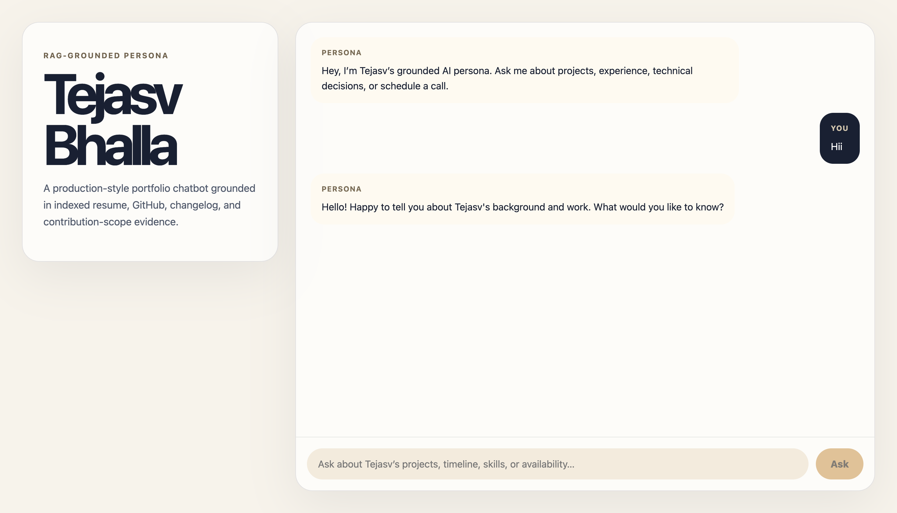
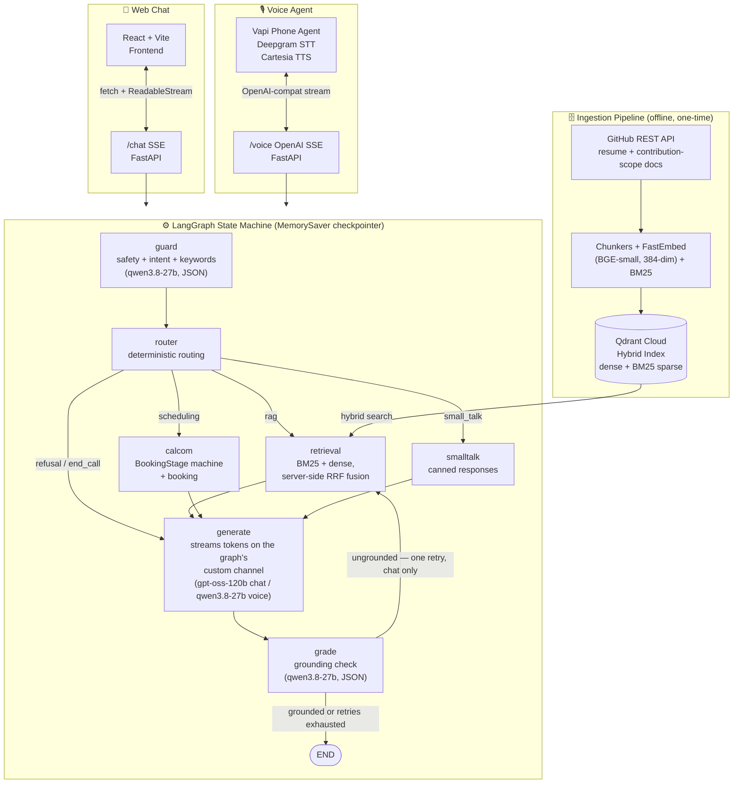

# AI Persona — RAG-Grounded Portfolio Voice & Chat Agent

> A production-grade, dual-mode AI persona for **Tejasv Bhalla** that answers recruiter questions grounded entirely in indexed personal knowledge, schedules meetings via live Cal.com integration, and completes end-to-end voice bookings — including verbal email capture — without any screen interaction.

[](https://python.org)
[](https://fastapi.tiangolo.com)
[](https://github.com/langchain-ai/langgraph)
[](https://qdrant.tech)
[](https://groq.com)
[](https://vapi.ai)
[](https://render.com)
[](https://github.com/Tejasv-bhalla/AI_Persona/actions/workflows/keep_alive.yml)



---

## Table of Contents

- [Overview](#overview)
- [Architecture](#architecture)
- [Feature Set](#feature-set)
- [Technology Stack](#technology-stack)
- [Cost Breakdown](#cost-breakdown)
- [Repository Structure](#repository-structure)
- [Prerequisites](#prerequisites)
- [Environment Variables](#environment-variables)
- [Local Setup](#local-setup)
- [Deployment](#deployment)
- [Voice Agent — Vapi Setup](#voice-agent--vapi-setup)
- [API Reference](#api-reference)
- [Graph Pipeline Deep Dive](#graph-pipeline-deep-dive)
- [Voice Booking Flow](#voice-booking-flow)
- [Security](#security)
- [Evaluation](#evaluation)
- [Performance Optimizations](#performance-optimizations)
- [Known Limitations & Tradeoffs](#known-limitations--tradeoffs)
- [License](#license)

---

## Overview

This project implements an AI-powered portfolio persona that operates across **two channels**:

| Channel | Interface | Description |
|:---|:---|:---|
| **Web Chat** | Browser (React + Vite) | Streaming RAG chat grounded in personal knowledge base |
| **Voice Call** | Phone (via Vapi) | Full conversational phone agent with real-time calendar booking |

Both channels share the same **LangGraph state machine** and **Qdrant retrieval backend**, ensuring consistent, hallucination-grounded responses across all surfaces.

---

## Architecture

### System Diagram


```mermaid
flowchart TD
    subgraph INGESTION["🗄️ Ingestion Pipeline (offline, one-time)"]
        GH["GitHub REST API\nresume + contribution-scope docs"]
        CH["Chunkers + FastEmbed\n(BGE-small, 384-dim) + BM25"]
        QD[("Qdrant Cloud\nHybrid Index\ndense + BM25 sparse")]
        GH --> CH --> QD
    end

    subgraph GRAPH["⚙️ LangGraph State Machine (MemorySaver checkpointer)"]
        G["guard\nsafety + intent + keywords\n(qwen3.8-27b, JSON)"]
        R["router\ndeterministic routing"]
        RET["retrieval\nBM25 + dense,\nserver-side RRF fusion"]
        CAL["calcom\nBookingStage machine\n+ booking"]
        ST["smalltalk\ncanned responses"]
        GEN["generate\nstreams tokens on the graph's\ncustom channel\n(gpt-oss-120b chat / qwen3.8-27b voice)"]
        GRD["grade\ngrounding check\n(qwen3.8-27b, JSON)"]
        FIN(["END"])
        G --> R
        R -->|rag| RET
        R -->|scheduling| CAL
        R -->|small_talk| ST
        R -->|"refusal / end_call"| GEN
        RET --> GEN
        CAL --> GEN
        ST --> GEN
        GEN --> GRD
        GRD -->|"ungrounded — one retry, chat only"| RET
        GRD -->|"grounded or retries exhausted"| FIN
    end

    QD -->|"hybrid search"| RET

    subgraph CHAT["💬 Web Chat"]
        FE["React + Vite\nFrontend"]
        SSE1["/chat SSE\nFastAPI"]
        FE <-->|"fetch + ReadableStream"| SSE1
    end

    subgraph VOICE["🎙️ Voice Agent"]
        VAPI["Vapi Phone Agent\nDeepgram STT\nCartesia TTS"]
        SSE2["/voice OpenAI SSE\nFastAPI"]
        VAPI <-->|"OpenAI-compat stream"| SSE2
    end

    SSE1 --> GRAPH
    SSE2 --> GRAPH
```

### Request Flow (Text)

```
guard → router → retrieval → generate → grade ─┬─ grounded ──────────→ END
                                               └─ ungrounded (chat) ──→ retrieval (once, wider pool)
                ↘ calcom    (scheduling intent) → generate → grade → END
                ↘ smalltalk (greeting)          → generate → grade → END
                ↘ generate  (refusal / end_call, canned reply)      → grade → END
```

Every route terminates in `generate`, including the canned ones — that node is the single place
where an answer reaches the client, whether it came from the model or from a fixed string.

---

## Feature Set

### Web Chat
- **Streaming responses** via Server-Sent Events (SSE), read with `fetch` + `ReadableStream` (not `EventSource`, because the request is a POST).
- **Hybrid RAG retrieval**: BM25 sparse + dense vector search, fused **server-side by Qdrant's RRF**. There is no second-stage reranker — see [Known Limitations & Tradeoffs](#known-limitations--tradeoffs).
- **Corrective RAG loop**: generation and grading both run inside the graph. When the grounding grader rejects an answer, the graph re-runs retrieval with a wider candidate pool and regenerates. The new answer arrives as `correction` SSE events and the frontend replaces what is already on screen. Maximum one retry.
- **Grounding indicator**: if the retry is exhausted and the answer still fails, `done` carries `grounded: false`. The UI shows a "low confidence" badge on an answer that was never corrected; a corrected answer is shown without one, on the grounds that the user already saw it get replaced.
- **Source-filtered retrieval**: the guard node infers the most likely source type (`resume`, `code`, `readme`, `changelog`, …) and narrows the Qdrant search accordingly.
- **Repo-aware retrieval**: a repo mention in free text ("the stock market project") is resolved against the repo names actually present in the index, and narrows the search to that repo.
- **Friendly rate-limit handling**: 429s from Groq are caught and surfaced as a polite message; a configurable fallback model takes over when the primary model is unavailable and nothing has been streamed yet.
- **Safety boundary**: raw user input never reaches the generator. The guard distills it into sanitized keywords before retrieval.
- **Markdown rendering + stop button**: answers render through `react-markdown`; an in-flight response can be aborted, keeping the partial text on screen.

### Voice Agent
- **Full phone booking** — zero screen required. The caller requests availability, the bot offers one slot at a time, captures name and email verbally, and finalizes the Cal.com booking via API.
- **Explicit booking state machine**: a `BookingStage` enum (`idle / offering / awaiting_name / awaiting_email / confirmed`) lives in graph state and is persisted across turns by a LangGraph `MemorySaver` checkpointer keyed on the Vapi call id. Slots are fetched **once per call** and reused.
- **Fast-Start streaming**: the first 4 words are flushed to Vapi as soon as they exist, so TTS can begin speaking before the sentence is finished.
- **Sentence-level streaming**: after the fast-start phrase, responses are streamed sentence-by-sentence to maintain natural TTS prosody.
- **Semantic response cache**: in-process cosine-similarity cache avoids redundant LLM calls for repeated questions (TTL 1 hour, similarity threshold 0.88, LRU-capped).
- **Verbal email parsing**: normalizes Deepgram transcriptions (`"john dot doe at gmail dot com."`) to clean email addresses.
- **Retry exemption**: voice skips the corrective retry entirely — the caller has already heard the answer, so a correction pass would only add latency to the next turn.

---

## Technology Stack

### Backend
| Component | Technology |
|:---|:---|
| API Framework | FastAPI 0.111+ |
| State Machine | LangGraph 0.2+ (with `MemorySaver` checkpointer) |
| LLM Provider | Groq Cloud (LPU inference) |
| Chat Model | `openai/gpt-oss-120b` (reasoning model) |
| Voice / Guard / Grader Model | `qwen/qwen3.8-27b` (no reasoning tokens) |
| Fallback Model | `openai/gpt-oss-20b` (pre-first-token failures only) |
| Vector DB | Qdrant Cloud |
| Embedding Model | `BAAI/bge-small-en-v1.5` (FastEmbed, 384-dim) |
| Sparse Search | BM25 (custom encoder) |
| Rate Limiting | slowapi |
| Calendar | Cal.com v2 API |
| HTTP Client | httpx (async, persistent connection pool) |
| Serialization | orjson |
| Runtime | Python 3.11+, Uvicorn |
| Containerization | Docker (python:3.11-slim, non-root user) |

### Model Selection

Groq decommissioned the entire Llama family this project ran on, so every role was remapped and each
choice was measured against the live API rather than picked by size:

| Role | Model | Why this one |
|:---|:---|:---|
| Chat generation | `openai/gpt-oss-120b` | The only role where a reasoning model is affordable: the 500-token chat cap absorbs the reasoning phase and still leaves room for the answer (179 output tokens measured) |
| Voice generation | `qwen/qwen3.8-27b` | Lowest measured time-to-first-token (~300 ms median, vs ~530 ms for `gpt-oss-20b` and ~640 ms for `gpt-oss-120b`) and no reasoning tokens at all |
| Guard (intent + safety, JSON) | `qwen/qwen3.8-27b` | 5/5 valid JSON at the 200-token cap, using 60 output tokens |
| Grounding grader (JSON) | `qwen/qwen3.8-27b` | Same; reasoning is wasted effort for a classifier |
| Fallback (pre-first-token failures) | `openai/gpt-oss-20b` | Used only when the primary model errors before a token is emitted; it is also a reasoning model, so the same empty-output risk applies if it is ever asked for JSON |

**Why the JSON roles do not use `gpt-oss`.** The `gpt-oss` models are reasoning models: they stream 37–87
`delta.reasoning` chunks before the first `delta.content`. The generator reads only `content`, which is
correct, but it has two consequences — time-to-first-token is higher, and under a tight token cap the
reasoning consumes the entire budget and the model returns **empty** output. That is not hypothetical: a
guard call at the 200-token cap came back `400 json_validate_failed` with an empty generation. Measured
over 5 varied guard prompts at that same cap, `openai/gpt-oss-20b` produced usable JSON **2/5** times and
spent up to 323 output tokens doing it, most of them reasoning; `qwen/qwen3.8-27b` produced it **5/5**
times using 60. A classifier gains nothing from thinking out loud, so guard and grader run on qwen. Voice
runs on qwen for the second reason: on a phone call the caller hears silence until the first token, and
qwen reaches it in roughly half the time of either `gpt-oss` model.

**Why the calls declare token caps.** Groq's free tier allows **1,000 output tokens per minute** and
admits a request against its `max_tokens`, not its actual output. The code previously set no `max_tokens`
at all, so qwen reserved its own default (1,102–1,392 tokens) and returned `429` on *every* call. Caps are
now mandatory — `max_output_tokens_json = 200`, `max_output_tokens_chat = 500`,
`max_output_tokens_voice = 300` — and because one chat turn makes three calls (guard 200 + generation 500
+ grader 200 = 900) they have to sum below the ceiling. `backend/tests/test_token_budget.py` pins that
invariant, so raising any one cap fails CI rather than silently 429-ing in production.

### Frontend
| Component | Technology |
|:---|:---|
| Framework | React 18 + TypeScript |
| Bundler | Vite 5 |
| Markdown | `react-markdown` |
| Styling | Vanilla CSS |
| Streaming | `fetch` + `ReadableStream` over SSE |

### Voice Infrastructure
| Component | Technology |
|:---|:---|
| Phone Platform | Vapi |
| Speech-to-Text | Deepgram (via Vapi) |
| Text-to-Speech | Cartesia (via Vapi) |
| Custom LLM | OpenAI-compatible SSE endpoint (`/voice`) |

### Deployment
| Service | Platform |
|:---|:---|
| Backend | Render (Free tier, Docker) |
| Frontend | Vercel / Netlify |
| Vector DB | Qdrant Cloud |

---

## Cost Breakdown

> All costs reflect **free-tier usage** as deployed. Paid-tier per-token pricing is not tracked in
> this repo — see the note under the chat table.

### Per Chat Turn (measured)

Output-token usage per chat turn, measured against the live Groq API. Input/prompt tokens are not
instrumented and are not counted here.

| Component | Measured usage | Cost |
|:---|:---|:---|
| Groq `openai/gpt-oss-120b` (generation) | 179 output tokens | **$0.00** (free tier) |
| Groq `qwen/qwen3.8-27b` (guard) | 92 output tokens | **$0.00** (free tier) |
| Groq `qwen/qwen3.8-27b` (grader) | 142 output tokens | **$0.00** (free tier) |
| Qdrant Cloud (vector search) | 1 hybrid query | **$0.00** (free cluster) |
| FastEmbed (local embedding) | 1 embedding | **$0.00** (runs in-process) |
| **Total per turn** | **413 output tokens** | **$0.00** |

> **The real constraint is throughput, not money.** Groq's free tier allows 1,000 output tokens per
> minute, so 413 measured tokens per turn puts the sustained ceiling at roughly **2.4 chat turns per
> minute**. Admission is against the declared `max_tokens` rather than actual output, which is why the
> three calls in a turn are capped at 200 + 500 + 200 = 900. A grounding retry adds a second generation
> and grader pass to that turn's budget.
>
> Paid Groq per-token pricing is **not tracked in this repo** — no rate here has been verified against
> Groq's current price list, so none is quoted.

### Per Voice Call (≈ 3 min booking call)

| Component | Free Tier Usage | Approx. Cost |
|:---|:---|:---|
| Vapi platform fee | ~3 min call | **~$0.09** ($0.05/min + STT/TTS) |
| Deepgram STT (via Vapi) | ~3 min audio | Included in Vapi |
| Cartesia TTS (via Vapi) | ~500 words spoken | Included in Vapi |
| Groq `qwen/qwen3.8-27b` (voice generation) | 300-token cap per turn, plus 200 for the guard | **$0.00** (free tier) |
| Cal.com booking API | 1 booking | **$0.00** (free plan) |
| **Total per call** | | **~$0.05–$0.10** |

> Groq token totals for a full voice call were never measured — only the per-turn caps are known. The
> Vapi/STT/TTS figures are estimates carried over from the original cost model and have not been
> reconciled against a real invoice.

### Monthly Infrastructure (Current Stack)

| Service | Plan | Monthly Cost |
|:---|:---|:---|
| Render (backend) | Free | **$0.00** |
| Qdrant Cloud | Free (1 node, 1GB) | **$0.00** |
| Groq Cloud | Free | **$0.00** |
| Vercel / Netlify (frontend) | Free | **$0.00** |
| Vapi | Pay-per-minute | **~$0.05–0.10/call** |
| Cal.com | Free | **$0.00** |
| **Total** | | **$0.00 fixed + usage** |

> **Note:** The only real cost is Vapi's per-minute charge for voice calls. Everything else runs free.

---

## Repository Structure

```
.
├── backend/
│   ├── Dockerfile
│   ├── pyproject.toml            # installs the `rag-persona` console script
│   ├── .env.example
│   └── src/rag_persona/
│       ├── main.py              # FastAPI app: /chat, /chat/eval, /voice, /book, /vapi-webhook, /health, /warm
│       ├── config.py            # Pydantic settings (env-driven), incl. rate limits + eval key
│       ├── schemas.py           # TypedDict graph state, Pydantic models, enums (incl. BookingStage)
│       ├── graph.py             # LangGraph builder: guard→router→…→generate→grade→(retry)
│       ├── prompts.py           # All LLM system prompts
│       ├── nodes/
│       │   ├── guard.py         # Safety + intent classification, keyword distillation
│       │   ├── router.py        # Deterministic routing (+ booking-stage override)
│       │   ├── retrieval.py     # Hybrid search, repo-filter resolution, keyword fallback, voice cache
│       │   ├── calcom.py        # BookingStage machine + Cal.com booking
│       │   ├── generator.py     # Streams tokens on the graph's custom channel
│       │   ├── grader.py        # Grounding judge + retry decision
│       │   └── smalltalk.py     # Canned small-talk responses
│       ├── services/
│       │   ├── groq_client.py   # Groq async wrapper (stream + JSON + fallback model)
│       │   ├── qdrant_store.py  # Hybrid RRF search, upsert, repo-name discovery
│       │   ├── embeddings.py    # FastEmbed dense embedding service
│       │   └── calcom.py        # Cal.com v2 API client (slots + bookings)
│       ├── voice/
│       │   ├── vapi_adapter.py  # Parse Vapi payload + format OpenAI SSE stream (fast-start)
│       │   └── response_cache.py # In-process semantic cache (vector + TTL + LRU)
│       └── ingestion/
│           ├── cli.py           # `rag-persona` CLI entry point
│           ├── github_pipeline.py # Clone-free GitHub ingestion
│           ├── chunkers.py      # Per-source chunking strategies
│           ├── gitlog.py        # Local git → changelog
│           └── bm25.py          # BM25 sparse encoder
├── frontend/
│   ├── index.html
│   ├── package.json
│   └── src/
│       └── main.tsx             # Chat UI: SSE streaming, correction handling, booking form
├── ingestion/
│   ├── pipeline.py              # Thin wrapper that calls the same CLI without installing the package
│   ├── .env.example
│   └── data/                    # Place resume + contribution_scope_*.md here (gitignored)
├── eval/
│   ├── run_evals.py             # RAGAS + custom judge evaluation runner
│   ├── golden_qa.json           # 10-question Golden Q&A test suite
│   └── results/                 # Committed output of the last eval run
├── scripts/
│   └── delete_by_repo.py        # Remove one repo's points from Qdrant
├── docs/                        # Architecture, deployment, API keys, ingestion pipeline
├── .github/workflows/           # keep_alive.yml, ci.yml
├── evals_report.md              # Evaluation report
├── render.yaml                  # Render deployment manifest
├── LICENSE                      # MIT
└── README.md
```

---

## Prerequisites

- **Python 3.11+**
- **Node.js 18+**
- **Docker** (for production builds)
- Accounts on: **Groq**, **Qdrant Cloud**, **Cal.com**, **Vapi**, **Render**

---

## Environment Variables

### Backend (`backend/.env`)

| Variable | Required | Description |
|:---|:---|:---|
| `GROQ_API_KEY` | ✅ | Groq Cloud API key |
| `QDRANT_URL` | ✅ | Qdrant Cloud cluster URL |
| `QDRANT_API_KEY` | ✅ | Qdrant Cloud API key |
| `QDRANT_COLLECTION` | ✅ | Collection name (default: `tejasv_knowledge_base`) |
| `ALLOWED_ORIGINS` | ✅ | CORS allowed origins (comma-separated) |
| `CALCOM_API_KEY` | ✅ | Cal.com live API key |
| `CALCOM_EVENT_TYPE_ID` | ✅ | Cal.com event type ID |
| `CALCOM_USERNAME` | ✅ | Cal.com username slug |
| `GROQ_GUARD_MODEL` | ❌ | Model for guard node (default: `qwen/qwen3.8-27b`) |
| `GROQ_GENERATION_MODEL` | ❌ | Model for chat generation (default: `openai/gpt-oss-120b`) |
| `GROQ_GRADER_MODEL` | ❌ | Model for the grounding grader (default: `qwen/qwen3.8-27b`) |
| `GROQ_VOICE_MODEL` | ❌ | Model for voice responses (default: `qwen/qwen3.8-27b`) |
| `GROQ_FALLBACK_MODEL` | ❌ | Used when the primary model errors before any token is streamed (default: `openai/gpt-oss-20b`) |
| `MAX_OUTPUT_TOKENS_JSON` | ❌ | `max_tokens` for the guard and grader JSON calls (default: `200`) |
| `MAX_OUTPUT_TOKENS_CHAT` | ❌ | `max_tokens` for chat generation (default: `500`) |
| `MAX_OUTPUT_TOKENS_VOICE` | ❌ | `max_tokens` for voice generation (default: `300`) |
| `VAPI_ASSISTANT_ID` | ❌ | Vapi assistant ID (surfaced by `/health`) |
| `VAPI_WEBHOOK_SECRET` | ❌ | Shared secret; when set, `/voice` and `/vapi-webhook` require the `x-vapi-secret` header |
| `EVAL_API_KEY` | ❌ | Shared secret for `/chat/eval`. **Unset ⇒ the endpoint returns 404** |
| `RATE_LIMIT_CHAT` | ❌ | slowapi limit for `/chat` and `/chat/eval` (default: `20/minute`) |
| `RATE_LIMIT_VOICE` | ❌ | slowapi limit for `/voice` (default: `60/minute`) |
| `RATE_LIMIT_BOOK` | ❌ | slowapi limit for `/book` (default: `5/hour`) |
| `VOICE_MAX_RESPONSE_WORDS` | ❌ | Max words per voice response (default: `80`) |
| `VOICE_CACHE_TTL_SECONDS` | ❌ | Voice semantic cache TTL in seconds (default: `3600`) |
| `VOICE_CACHE_MAX_ENTRIES` | ❌ | Voice cache LRU capacity (default: `256`) |
| `MAX_RETRIEVAL_CANDIDATES` | ❌ | Qdrant candidates per chat query (default: `8`) |
| `MAX_CONTEXT_CHUNKS` | ❌ | Chunks passed to the generator (default: `5`) |

### Ingestion (`ingestion/.env`)

| Variable | Required | Description |
|:---|:---|:---|
| `GITHUB_TOKEN` | ✅ | GitHub personal access token (read-only) |
| `GITHUB_USERNAME` | ✅ | Your GitHub username |
| `QDRANT_URL` | ✅ | Qdrant Cloud cluster URL |
| `QDRANT_API_KEY` | ✅ | Qdrant Cloud API key |
| `QDRANT_COLLECTION` | ✅ | Collection name |
| `REPO_BLOCKLIST` | ❌ | JSON list of repo names to skip (e.g. this repo itself) |

### Frontend (`frontend/.env`)

| Variable | Required | Description |
|:---|:---|:---|
| `VITE_API_BASE_URL` | ✅ | Backend URL (`http://localhost:8000` locally, Render URL in prod) |

---

## Local Setup

### 1. Clone & Configure

```bash
git clone https://github.com/<your-username>/AI_Persona.git
cd AI_Persona
```

### 2. Ingestion Pipeline

Place your personal knowledge files in `ingestion/data/`:

```
ingestion/data/
├── resume.pdf                     # or resume.md / resume.txt
├── contribution_scope_<repo>.md   # required for every external/team repo
├── arch_decisions_<repo>.md       # optional
└── dev_log_<repo>.md              # optional
```

```bash
cp ingestion/.env.example ingestion/.env
# Fill in GITHUB_TOKEN, GITHUB_USERNAME, QDRANT_URL, QDRANT_API_KEY

# Option A — install the backend package and use the console script
pip install -e backend
rag-persona github

# Option B — run the same CLI without installing
python ingestion/pipeline.py github

# Include external team repos (a contribution-scope file is then mandatory)
rag-persona github --external-repo https://github.com/org/team-project

# Rehearse without writing to Qdrant
rag-persona github --dry-run
```

Available `github` flags: `--username`, `--external-repo` (repeatable), `--resume`, `--data-dir`,
`--no-reset`, `--dry-run`. Re-ingestion drops and rebuilds the collection by default; see
[docs/INGESTION_PIPELINE.md](docs/INGESTION_PIPELINE.md) for why append-only ingestion is not offered.

> **Note**: No local cloning is performed. All files and commit history are fetched via the GitHub REST API.

### 3. Backend

```bash
cd backend
cp .env.example .env          # fill in all required values

python -m venv .venv
source .venv/bin/activate     # Windows: .venv\Scripts\activate
pip install -e ".[dev]"

uvicorn rag_persona.main:app --reload --port 8000
```

Verify:
```bash
curl http://localhost:8000/health
```

### 4. Frontend

```bash
cd frontend
cp .env.example .env          # set VITE_API_BASE_URL=http://localhost:8000

npm install
npm run dev
# Open http://localhost:5173
```

### 5. Quality Gates

`.github/workflows/ci.yml` runs on push and pull request:

| Job | Steps |
|:---|:---|
| Backend | `ruff check src tests` → `mypy src` (strict) → `pytest -q` |
| Frontend | `npm ci` → `npm run build` (which is `tsc && vite build`, so the typecheck runs first) |

Run the same checks locally from `backend/` with `ruff check src`, `mypy src`, and `pytest -q`.

---

## Deployment

### Backend — Render

The project includes a `render.yaml` manifest for zero-config deployment.

1. Push this repository to GitHub.
2. Go to [render.com](https://render.com) → **New Web Service** → connect your GitHub repo.
3. Render auto-detects `render.yaml` and configures the service.
4. In your Render Dashboard → **Environment**, add all secrets manually:
   - `GROQ_API_KEY`
   - `QDRANT_URL`, `QDRANT_API_KEY`
   - `CALCOM_API_KEY`, `CALCOM_EVENT_TYPE_ID`, `CALCOM_USERNAME`
   - `ALLOWED_ORIGINS` (your frontend URL)
   - `VAPI_WEBHOOK_SECRET` — **set this**; without it `/voice` accepts unauthenticated LLM calls
   - `EVAL_API_KEY` — leave unset in production to keep `/chat/eval` disabled (404)
5. Click **Manual Deploy** → **Deploy latest commit**.

> **Keep-Alive**: Render's free tier sleeps after 15 minutes of inactivity. `.github/workflows/keep_alive.yml`
> pings `/health` on a 10-minute cron and on every push to `main`. GitHub throttles scheduled workflows on
> quiet repos, so an external monitor (e.g. [cron-job.org](https://cron-job.org)) is a more reliable backstop.

### Frontend — Vercel / Netlify

```bash
cd frontend && npm run build   # outputs to dist/
```

Deploy the `dist/` folder. Set `VITE_API_BASE_URL` to your Render backend URL in the hosting dashboard.

---

## Voice Agent — Vapi Setup

1. Create an account at [vapi.ai](https://vapi.ai).
2. Create a new **Assistant**.
3. Under **Model**, select **Custom LLM** and set the URL to:
   ```
   https://<your-render-service>.onrender.com/voice
   ```
4. Configure **Speech-to-Text**: Deepgram (recommended).
5. Configure **Text-to-Speech**: Cartesia or ElevenLabs.
6. Assign a **Phone Number** to the assistant.
7. Copy the `Assistant ID` and add it to your backend's `VAPI_ASSISTANT_ID` env var.
8. Set a custom header `x-vapi-secret` matching `VAPI_WEBHOOK_SECRET` so the endpoint is not open to the world.

The `/voice` endpoint is OpenAI-compatible — Vapi sends conversation history and the backend returns chunked SSE tokens.

---

## API Reference

### `GET /health`
Returns server status and voice configuration state.

```json
{
  "status": "ok",
  "timestamp": "2026-06-06T10:00:00Z",
  "voice": "configured",
  "vapi_assistant_id": "..."
}
```

### `GET /warm`
Forces the FastEmbed model to load. The frontend calls this on page load to absorb Render's cold start.

---

### `POST /chat`
Streaming chat endpoint. Returns `text/event-stream` SSE. Rate-limited by `RATE_LIMIT_CHAT`.

**Request body:**
```json
{
  "message": "Tell me about Tejasv's projects.",
  "session_id": "optional-session-uuid",
  "conversation_history": [
    {"role": "user", "content": "..."},
    {"role": "assistant", "content": "..."}
  ]
}
```

**SSE Events:**
| Event type | Description |
|:---|:---|
| `meta` | Route taken (`rag`, `scheduling`, `small_talk`, `refusal`, `end_call`) |
| `token` | A streamed text token |
| `correction` | A token of a **regenerated** answer after a failed grounding check; the client discards the answer rendered so far on the first one |
| `done` | End of stream; includes `grounded: bool` and `available_slots` |
| `error` | Friendly error message (e.g. rate limit reached) |

> `session_id` doubles as the checkpointer thread id, so booking and conversation state persist across turns.

---

### `POST /chat/eval`
Non-streaming variant used by the offline eval harness. Returns `{response, retrieved_contexts, grounded}`.
Requires the `x-eval-key` header and returns **404 when `EVAL_API_KEY` is unset**.

---

### `POST /voice`
OpenAI-compatible custom LLM endpoint for Vapi (also mounted at `/voice/chat/completions`). Accepts Vapi's
request payload format and returns an SSE stream in OpenAI's `choices[].delta.content` format. Requires the
`x-vapi-secret` header when `VAPI_WEBHOOK_SECRET` is set. Rate-limited by `RATE_LIMIT_VOICE`.

---

### `POST /book`
Direct calendar booking endpoint. `attendee_email` is validated as a real email address by Pydantic
`EmailStr`. Rate-limited by `RATE_LIMIT_BOOK`.

**Request body:**
```json
{
  "preferred_time": "2026-06-09T10:00:00.000+05:30",
  "attendee_name": "Jane Doe",
  "attendee_email": "jane@company.com",
  "notes": null
}
```

---

### `POST /vapi-webhook`
Receives Vapi lifecycle events (`call-started`, `call-ended`, `transcript`). Validates the `x-vapi-secret`
header if `VAPI_WEBHOOK_SECRET` is set.

---

## Graph Pipeline Deep Dive

### Guard Node
- Runs a hardcoded prompt-injection keyword failsafe **before** any model call (chat mode only — a phone caller cannot paste an injection payload, and the markers produce false positives on speech).
- Runs `qwen/qwen3.8-27b` to classify intent (`rag`, `scheduling`, `small_talk`, `end_call`) and safety (`safe`, `suspicious`, `malicious`).
- Distills raw user input into sanitized `keywords` used for retrieval.
- Infers a `source_filter` to narrow the Qdrant search (e.g. `resume` for education questions).
- Malicious and suspicious inputs are refused before any retrieval occurs.

### Router Node
- Deterministically routes based on guard output — no second model call.
- If `booking_stage` is mid-conversation (`offering`, `awaiting_name`, `awaiting_email`), routing is forced to `scheduling`. Without this, an utterance like *"john at gmail dot com"* looks like a factual question to the guard and the booking would be silently dropped.

### Retrieval Node
- Resolves an optional repo filter from the raw input, then the guard keywords, then the last user turn.
- Generates a dense query vector via FastEmbed (on a worker thread, so the event loop is not blocked).
- Voice only: checks the in-process semantic cache (cosine ≥ 0.88). A cache hit short-circuits both retrieval and generation.
- Performs a hybrid query: a dense prefetch and a BM25 sparse prefetch, fused by **Qdrant's server-side RRF**, and takes the top `max_context_chunks` (default 5).
- **Fallback**: if the guard's generated keywords return fewer than 2 candidates, the search is repeated with the user's raw wording and the better result wins.
- **On a grounding retry**: the candidate pool and the context window are both widened (+4 candidates, +2 chunks), and the voice cache is skipped — the cached answer is the one that just failed.

### Cal.com Node
- Fetches up to 5 available slots **once per call** and pins them into graph state. Re-fetching every turn let availability shift underneath "the second one" mid-conversation.
- Voice runs the explicit `BookingStage` machine: **idle → offering → awaiting_name → awaiting_email → confirmed**.
- Chat skips the machine entirely and returns the slot list for the frontend's booking form.
- Every Cal.com failure degrades to a `cal.com/<username>` link rather than an error.

### Generator Node
- Selects the model by mode: `openai/gpt-oss-120b` for chat, `qwen/qwen3.8-27b` for voice — see [Model Selection](#model-selection) for why the two differ.
- Emits tokens on **LangGraph's custom stream channel** (`get_stream_writer`), which is why moving generation inside the graph costs nothing in time-to-first-token: the API layer consumes `stream_mode=["custom", "values"]` and forwards custom chunks straight to the client while the graph is still running.
- On a retry pass it emits `correction` events instead of `token` events.
- Canned replies (refusals, sign-offs, small talk, Cal.com messages) travel the same channel, so the client has one code path.

### Grade Node
- Runs `qwen/qwen3.8-27b` against the retrieved chunks (stripped of source metadata — the grader judges text support only).
- If the answer is grounded, or the single retry has already been spent, the graph ends and `done` reports `grounded`.
- If not, it clears `answer`, increments `retry_count`, and routes back to `retrieval`.
- Skipped for voice, for non-`rag` routes, and when nothing was retrieved. Fails **open**: a grader outage never blocks an answer.

---

## Voice Booking Flow

```
Recruiter: "Can I schedule a call?"                       [stage: idle → offering]
    ↓
Bot: "My next available slot is Monday, June 9th at 10 AM. Does that work?"
    ↓
Recruiter: "No, that doesn't work."                       [stage: offering, index +1]
    ↓
Bot: "How about Monday, June 9th at 10:30 AM?"
    ↓
Recruiter: "Yes, that works."                             [stage: offering → awaiting_name]
    ↓
Bot: "Great! Can I get your name first?"
    ↓
Recruiter: "Sarah Connor."                                [stage: awaiting_name → awaiting_email]
    ↓
Bot: "And what email address should I send the calendar invitation to?"
    ↓
Recruiter: "sarah dot connor at skynet dot com."
    ↓ [normalize → sarah.connor@skynet.com]               [stage: awaiting_email → confirmed]
Bot: "Perfect! I've booked our meeting for Monday, June 9th at 10:30 AM..."
    ↓
[Cal.com API creates booking + sends calendar invite]
```

The stage lives in graph state, persisted by the checkpointer under the Vapi call id — it is never
re-derived by string-matching the assistant's own previous message. A caller who names a slot outright
("the third one", "Tuesday at 10:30") jumps straight to it instead of walking the list.

---

## Security

| Surface | Control |
|:---|:---|
| `/chat`, `/chat/eval`, `/voice`, `/book` | Per-IP rate limits via slowapi, configurable through `RATE_LIMIT_*`. The limiter key prefers the leftmost `X-Forwarded-For` hop, because Render terminates TLS at a proxy |
| `/voice`, `/vapi-webhook` | `x-vapi-secret` header, compared with `hmac.compare_digest`, required whenever `VAPI_WEBHOOK_SECRET` is set |
| `/chat/eval` | Gated behind `EVAL_API_KEY`; returns **404** (not 401) when the key is unset, so the endpoint does not exist in production |
| `/book` | `attendee_email` validated as `EmailStr`; name and notes length-capped |
| All endpoints | Client-facing errors are generic strings. Exception detail goes to the logs only |
| Prompt injection | Hardcoded marker check before the guard model, plus the guard's own safety verdict. Raw input never reaches the generator |
| Container | Docker image drops root and runs as an unprivileged user |

The startup lifespan logs a warning when `VAPI_WEBHOOK_SECRET` or `EVAL_API_KEY` is missing, so a
misconfigured deploy is visible in the Render logs rather than silent.

---

## Evaluation

The harness lives in `eval/run_evals.py` and runs a **10-question Golden Q&A set** (`eval/golden_qa.json`)
against a live backend: 7 in-scope questions covering resume, README, changelog and contribution-scope
sources, plus 3 adversarial/out-of-scope probes. It measures latency, collects answers and their retrieved
contexts from `/chat/eval`, scores them with **RAGAS**, and separately classifies each answer with an
LLM judge (`gemini-3.1-flash-lite`).

### Results

Two full runs were made on the same golden set, one with `openai/gpt-oss-120b` as the chat generator and
one with `qwen/qwen3.8-27b`. Every metric landed within noise of the other, so the generation model is not
the variable that moves these numbers — the table below reports the qwen run, which is the shipped stack.

| Metric | Before | After | |
|:---|:---|:---|:---|
| LLM judge — correct | 60% (6/10) | **80% (8/10)** | ✅ |
| LLM judge — refused | 20% (2/10) | **10% (1/10)** | ✅ |
| LLM judge — hallucinated | 0% | **0%** | ✅ |
| Context Recall | 0.57 | **0.71** | ✅ |
| Context Precision | 0.55 | 0.55 | — |
| Answer Relevancy | 0.67 | 0.66 | — |
| Faithfulness | 0.97 | 0.70 | ⚠️ see below |
| Retrieved contexts per question | 3, 3, 3 … | 5, 5, 4, 5 … | ✅ |
| Index size | 1,371 chunks | 1,787 chunks | |

RAGAS metrics are over the 7 in-scope questions; the judge covers all 10 including the adversarial probes.
"Before" is the last run on the previous retrieval code (`max_context_chunks = 3`, no raw-input fallback,
no corpus-derived repo filter, no corrective retry).

### Reading the faithfulness drop honestly

**The 0.97 was inflated and the 0.70 is mostly a measurement artifact.** Both need saying.

The old 0.97 was high partly *because* the system refused more often — an answer that says "I don't have
that in the indexed knowledge base" makes no unsupported claims and scores perfectly. Answering more, which
is the point of the retrieval work, necessarily exposes more surface to the metric.

The remainder appears to be RAGAS penalising paraphrase and list formatting rather than catching real
hallucination. One question scored faithfulness **0.00** while its retrieval scored precision 1.00 and
recall 1.00, and the LLM judge independently rated the same answer **correct**; re-running it by hand, every
commit hash and message in the answer is present in the retrieved context. At N=7 with an LLM-judged metric,
individual scores are noisy enough that the aggregate should not be over-read. The judge's hallucination
count — still **0/10** — is the more trustworthy signal, and it agrees with manual inspection.

### Latency, and what the number actually measures

Median time-to-first-token for the run was **2,190 ms**. That figure is **dominated by Groq free-tier
throttling, not by the architecture**: the tier allows 1,000 output tokens per minute, a chat turn costs
~413, and the Groq SDK retries a 429 silently with multi-second backoff. Ten rate-limit events were logged
during the run, with observed backoffs of 7 s and 11 s.

Measured per graph node on an unthrottled request, the honest breakdown is:

| Stage | Median | Share of TTFT |
|:---|---:|---:|
| `guard` (classifier LLM round trip) | 494 ms | 37% |
| `router` | 2 ms | — |
| `retrieval` (embed + hybrid Qdrant search) | 303 ms | 22% |
| `generate` → first token | ~550 ms | 41% |
| **Time to first token** | **~1,350 ms** | |
| `grade` (after the answer; delays `done`, not TTFT) | 588 ms | — |

Most of the retrieval cost is network round trip to a `us-west-2` cluster, not search time. Two fixes came
out of this profiling: the search was still requesting `with_vectors=True` for the reranker that no longer
exists, and the resulting dead 384-float payload per chunk inflated every LangGraph checkpoint write —
removing it cut the retrieval node from 683 ms to 303 ms in-graph. Greetings and sign-offs now skip the
guard LLM entirely, taking those turns from ~500 ms to ~0 ms and zero Groq tokens.

Earlier published latency figures (median 981 ms) measured the first **SSE event** — the `meta` route frame
emitted before generation starts — not the first generated token. The harness now records both, so the two
are no longer conflated. The comparable first-SSE-event figure for this run is ~500 ms.

### What is still broken

**Context precision is unchanged at 0.55, and question 2 still fails.** *"What work experience or
internships does Tejasv have?"* is still answered with a refusal despite the information being in the
corpus — the judge's verdict is blunt about it. So one of the two remaining non-correct verdicts is a
retrieval miss, not a safety success, exactly as before. Recall improved; precision did not. The next
lever is the indexing side rather than the query side: 1,182 of 1,787 chunks are raw code bodies with no
natural-language summary, which embed poorly against how a recruiter phrases a question.

### What was changed in response

| Change | Failure it targets |
|:---|:---|
| `max_context_chunks` raised 3 → 5 | Recall 0.0 on questions whose answer spans several chunks |
| Fallback re-search with the user's raw wording when guard keywords return < 2 candidates | Off-target classifier keywords starving the search |
| Repo filter derived from the repo names actually in Qdrant, instead of a hardcoded dict | Repo mentions the old dict did not know about |
| Ambiguous repo mentions deliberately return **no** filter | A wrong filter is worse than none — it guarantees recall 0 |
| Corrective retry: an ungrounded answer re-runs retrieval with +4 candidates and +2 chunks | Narrow first-pass retrieval, the likeliest cause of an ungrounded answer |

### Harness integrity

Two changes to `run_evals.py` matter more than any score in this table:

- The RAGAS failure path used to return hardcoded placeholder scores (0.88 / 0.89 / 0.85 / 0.84) that were
  indistinguishable from measured ones. It now raises.
- Judge API failures used to be recorded as `refused` verdicts, silently corrupting the refusal rate. They
  are now a distinct `error` verdict that aborts the run.

A metric you cannot trust is worse than no metric. See [evals_report.md](evals_report.md) for the full report.

---

## Performance Optimizations

| Optimization | Impact |
|:---|:---|
| Fast-Start streaming (first 4 words flushed as soon as they exist) | TTS begins speaking before the full sentence is generated, so the caller does not sit in silence while the model finishes |
| Sentence-level streaming (after fast-start) | Natural TTS prosody, no stutter; the sentence regex avoids splitting on decimals and domains |
| Generation inside the graph, streamed on the custom channel | The corrective retry became possible without paying for it in time-to-first-token |
| Semantic response cache (cosine ≥ 0.88, TTL 1h, LRU 256) | Eliminates redundant LLM + DB calls for repeated voice queries; vectors are pre-normalized so a lookup is one matrix-vector product |
| Voice retrieval capped at 5 candidates | Trades recall for latency on the channel where latency is audible |
| FastEmbed inference on a worker thread | ONNX embedding is CPU-bound; keeping it off the event loop stops it blocking other requests |
| Persistent `httpx.AsyncClient` in CalComClient | Avoids TCP + TLS handshake overhead on every calendar call |
| Guard and grader on `qwen/qwen3.8-27b` rather than a reasoning model | A `gpt-oss` model spends its whole 200-token JSON budget on `delta.reasoning` and returns empty output (2/5 success on measured guard prompts); qwen answers 5/5 in 60 output tokens |
| Voice generation on `qwen/qwen3.8-27b` | Median time-to-first-token for a voice-shaped generation was ~300 ms, against ~530 ms for `gpt-oss-20b` and ~640 ms for `gpt-oss-120b`; qwen emits no reasoning tokens, and TTFT is the metric a caller actually hears |
| Greetings and sign-offs skip the guard LLM (deterministic vocabulary match) | The guard is a full round trip and 37% of time-to-first-token; a greeting needs no retrieval and no distilled keywords. Those turns went from ~500 ms to ~0 ms and stopped consuming the free-tier token budget. Anything with a question mark, more than six words, or a single content word falls through to the model |
| `with_vectors=False` on Qdrant search | The 384-float vector per chunk was left over from the removed reranker and nothing read it; it inflated every LangGraph checkpoint write. Removing it cut the retrieval node from 683 ms to 303 ms in-graph |
| Repo-name lookup cached after the first Qdrant scroll | Repo-filter resolution costs one scroll per process, not one per query |
| Source-filtered Qdrant search | Narrows the candidate pool; a wrong filter is avoided by returning none when the mention is ambiguous |
| `/warm` called on frontend page load | Absorbs Render's free-tier cold start before the first question |

> The TTFT figures above are direct measurements of the Groq API for a voice-shaped generation — model
> latency only. **End-to-end voice latency** (caller speech → STT → graph → TTS → audible reply) was only
> ever observed informally during manual test calls. It is **not** part of the committed eval run and no
> end-to-end voice latency figure is published here.

---

## Known Limitations & Tradeoffs

### Free Tier Constraints
- **Groq free tier**: **1,000 output tokens per minute**, admitted against a request's declared `max_tokens` rather than its actual output. That is the binding limit in practice, not a daily cap. Each of a chat turn's three calls therefore declares a cap (200 guard + 500 generation + 200 grader = 900), and measured actual usage of 413 tokens per turn puts sustained throughput at roughly **2.4 chat turns per minute** — fine for a portfolio demo, not for concurrent traffic. `backend/tests/test_token_budget.py` fails the build if a future edit pushes the caps over the ceiling.
- **Render free tier**: 512MB RAM and sleep-after-15-minutes. Both constrain the architecture directly — see the reranker tradeoff below.

### Tradeoffs Made
- **No reranker at all.** FlashRank's ONNX cross-encoder (150–220MB) plus the FastEmbed pipeline exceeded Render's 512MB ceiling and OOM-crashed the container, so it was removed. It was **not replaced**: the retrieval node returns Qdrant's RRF-fused candidates directly. This is the single biggest known weakness in the system, and the eval numbers show it — context precision 0.55 is exactly the metric a reranker exists to raise. A cross-encoder rerank on a paid instance, or a hosted rerank API, is the obvious next step.
- **Eval numbers are stale.** The committed run predates the retrieval changes listed in [Evaluation](#evaluation). Re-running the suite requires a live backend with `EVAL_API_KEY` set and a Gemini key for RAGAS and the judge.
- **The grounding retry is chat-only.** In voice, the caller has already heard the answer before a verdict lands, so an ungrounded voice answer is simply not corrected. Voice trades correctness for latency, deliberately.
- **One retry, not many.** A second retry adds latency without meaningfully changing the verdict in observed cases. The cost is that a genuinely hard question fails twice and returns with `grounded: false`.
- **The grader fails open.** If the grader errors, the answer ships marked as grounded. The alternative — blocking on a grader outage — is worse for a user waiting on a stream, but it does mean `grounded: true` is weaker evidence than it looks.
- **The JSON roles deliberately run on a non-reasoning model.** Guard and grader return JSON, and the `gpt-oss` models stream 37–87 `delta.reasoning` chunks before any content. At the 200-token JSON cap that reasoning eats the whole budget and the model returns empty output — observed as a real `400 json_validate_failed` on a guard call with an empty generation. Over 5 varied guard prompts at that cap, `openai/gpt-oss-20b` succeeded 2/5 and spent up to 323 output tokens; `qwen/qwen3.8-27b` succeeded 5/5 using 60. Reasoning tokens are pure overhead for a classifier and they break the free-tier budget, so the JSON roles use qwen. The generator keeps `gpt-oss-120b`, where the 500-token cap absorbs the reasoning — whether that reasoning actually improves the answers here has **not** been measured.
- **Dependency on specific hosted model IDs.** Every LLM call names a model hosted by Groq. Groq retired the entire Llama family this project used — `llama-3.1-8b-instant` and `llama-3.3-70b-versatile` now return `404 model_not_found` — and every LLM call in the system failed until the stack was remapped to `openai/gpt-oss-120b` and `qwen/qwen3.8-27b`. The IDs are env-overridable, so the remap was a config change rather than a code change, but the replacements behaved differently enough (reasoning tokens, token-cap admission) that prompts and limits had to be re-measured, not just renamed. Nothing here pins or self-hosts a model: a provider deprecation is a full outage, and the honest mitigations — a self-hosted pinned model, or a provider abstraction with a tested second backend — are both out of scope for a free-tier deploy.
- **In-process state, single instance.** Both the `MemorySaver` checkpointer and the voice semantic cache live in one process's memory. They are lost on restart and not shared between instances, so the service cannot be scaled horizontally without a shared checkpointer and cache.
- **Vapi over direct Twilio**: Vapi's managed telephony reduced integration time significantly. A direct Twilio WebSockets pipeline would give more control over barge-in sensitivity and SIP routing, but was out of scope for the timeline.
- **No incremental ingestion.** Re-ingestion drops and rebuilds the collection. BM25 IDF is corpus-global, so appending chunks scored against a recomputed IDF would produce sparse vectors that are not comparable with the ones already indexed. A full rebuild is slower but correct.
- **End-to-end voice latency is unmeasured.** Model time-to-first-token *was* measured directly against the Groq API (~300 ms median for qwen), but the caller-perceived round trip — speech → STT → graph → TTS → audible reply — was only ever observed informally during manual calls and never instrumented, so this README publishes no end-to-end voice latency figure.
- **CI**: `.github/workflows/ci.yml` runs ruff, mypy and pytest on the backend and a typecheck + build on the frontend. `backend/tests/` holds 11 test modules covering the guard, router, corrective retry loop, BM25 encoding, chunkers, repo-filter resolution, the Cal.com stage machine and verbal-email parsing, the Vapi adapter, and the free-tier token budget. Coverage is not measured and there are no integration tests against live Groq, Qdrant or Cal.com — every external call is faked.

---

## License

MIT License. See [LICENSE](LICENSE) for details.

---

<p align="center">Built by <strong>Tejasv Bhalla</strong> · IIT Roorkee · <a href="https://cal.com/tejasv-kajrwr">Book a call</a></p>
