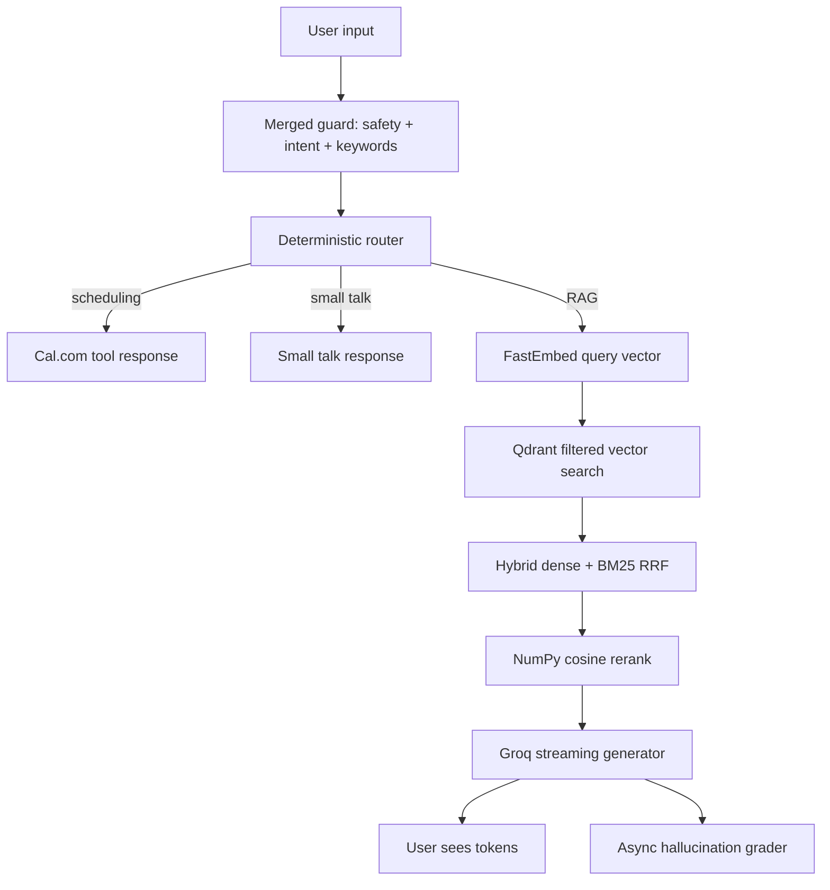

# Architecture

## Runtime rule

Raw user input stops at the guard node. The generator sees only sanitized keywords and retrieved context.

## Memory rule

FastEmbed is lazy-loaded. Ingestion is offline. The web container only performs query-time retrieval and generation.

## Grounding rule

If the answer is absent from retrieved context, the persona must say the indexed knowledge base does not contain it.
