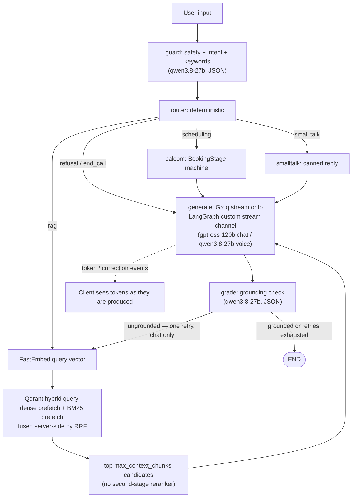

# Architecture

The whole request path is one LangGraph graph, compiled in `backend/src/rag_persona/graph.py` with a
`MemorySaver` checkpointer. Generation and grading run **inside** the graph, which is what makes the
corrective retry edge possible.

```mermaid
flowchart TD
  A["User input"] --> B["guard: safety + intent + keywords\n(qwen3.8-27b, JSON)"]
  B --> C["router: deterministic"]
  G["generate: Groq stream onto\nLangGraph custom stream channel\n(gpt-oss-120b chat / qwen3.8-27b voice)"]
  C -->|scheduling| D["calcom: BookingStage machine"]
  C -->|small talk| E["smalltalk: canned reply"]
  C -->|"refusal / end_call"| G
  C -->|rag| F["FastEmbed query vector"]
  F --> H["Qdrant hybrid query:\ndense prefetch + BM25 prefetch\nfused server-side by RRF"]
  H --> I["top max_context_chunks candidates\n(no second-stage reranker)"]
  I --> G
  D --> G
  E --> G
  G --> J["grade: grounding check\n(qwen3.8-27b, JSON)"]
  J -->|"ungrounded — one retry, chat only"| F
  J -->|"grounded or retries exhausted"| K(["END"])
  G -.->|"token / correction events"| L["Client sees tokens as they are produced"]
```

## Runtime rule

Raw user input stops at the guard node. The generator sees only sanitized keywords and retrieved context.

The one exception is retrieval itself: the raw input is used to resolve a repo filter, and is re-embedded
as a fallback query when the guard's keywords return fewer than two candidates. It is never placed in a
prompt.

## Retrieval rule

Hybrid search is real but **single-stage**. Qdrant runs a dense prefetch and a BM25 sparse prefetch and
fuses them with Reciprocal Rank Fusion server-side; the retrieval node takes that ordering as-is and
truncates it. There is no cross-encoder or cosine reranking step — see the reranker trade-off in
[`../evals_report.md`](../evals_report.md).

## Model rule

Two model families, split by what each role needs.

| Role | Model |
|---|---|
| Chat generation | `openai/gpt-oss-120b` |
| Voice generation | `qwen/qwen3.8-27b` |
| Guard (intent + safety, JSON) | `qwen/qwen3.8-27b` |
| Grounding grader (JSON) | `qwen/qwen3.8-27b` |
| Fallback (pre-first-token failures) | `openai/gpt-oss-20b` |

The `gpt-oss` models are reasoning models: they emit 37–87 `delta.reasoning` chunks before the first
`delta.content`. The generator reads only `content`, so the output is correct, but the reasoning still
costs time-to-first-token and still consumes the output-token budget. Under a tight cap it consumes all of
it and the model returns empty output — measured at the 200-token JSON cap, `openai/gpt-oss-20b` returned
usable JSON on 2 of 5 guard prompts (up to 323 output tokens spent), while `qwen/qwen3.8-27b` returned it
on 5 of 5 using 60. So: reasoning model where the budget is wide and quality matters (chat generation),
non-reasoning model everywhere output is a fixed-shape JSON verdict, and on voice, where median
time-to-first-token was ~300 ms for qwen against ~530 ms (`gpt-oss-20b`) and ~640 ms (`gpt-oss-120b`).

Groq's free tier allows 1,000 output tokens per minute and admits a request against its `max_tokens`
rather than its actual output, so each primary call declares a cap: 200 for JSON, 500 for chat, 300 for
voice. One chat turn is three calls (guard + generation + grader), so those caps must sum below the
ceiling — `backend/tests/test_token_budget.py` asserts exactly that.

## Streaming rule

`generate` runs inside the graph but emits every token immediately on LangGraph's custom stream channel
(`get_stream_writer`). The API layer consumes `stream_mode=["custom", "values"]` and forwards custom
chunks to the client while the graph is still executing, so putting generation in the graph costs nothing
in time-to-first-token.

A regenerated answer is emitted as `correction` events rather than `token` events, so the browser knows to
discard what it has already rendered and start again.

## Grounding rule

If the answer is absent from retrieved context, the persona must say the indexed knowledge base does not
contain it.

The `grade` node checks that after the fact. On failure it clears `answer`, increments `retry_count`, and
routes back to `retrieval`, which widens the candidate pool (+4 candidates, +2 chunks). Maximum one retry;
after that the answer ships with `grounded: false` and the UI badges it. The grader fails **open** — a
grader outage marks the answer grounded rather than blocking a user mid-stream. Voice skips grading
entirely, because the caller has already heard the answer.

## State rule

`PersonaState` is a `TypedDict`. Per-turn keys (`answer`, `chunks`, `route`, `grounded`, `retry_count`,
`available_slots`) are reset explicitly on every invocation; everything else — notably `booking_stage`,
`booking_slots`, `booking_slot_index`, `booking_name`, `booking_email` — is carried forward by the
checkpointer, keyed on the chat `session_id` or the Vapi call id.

The checkpointer is in-process. It is lost on restart and not shared between instances; a multi-instance
deploy needs a shared checkpointer.

## Memory rule

FastEmbed is lazy-loaded and its inference runs on a worker thread, off the event loop. Ingestion is
offline. The web container only performs query-time retrieval and generation. The 512MB Render ceiling is
the reason there is no reranker model in this process.
